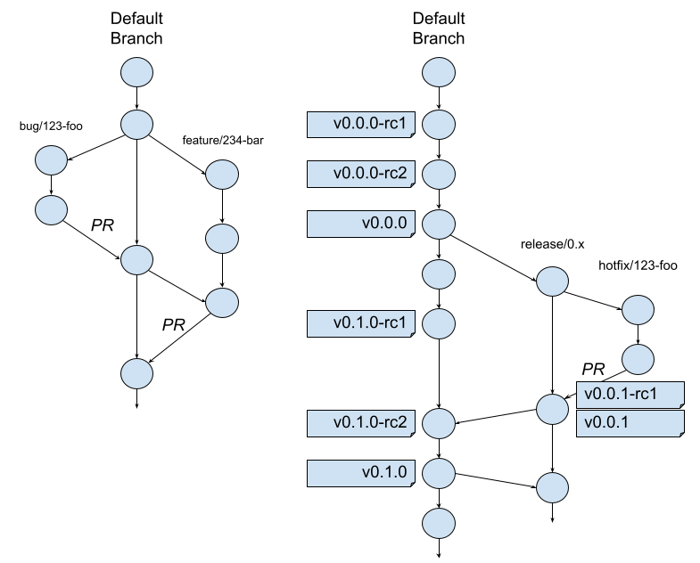

# Cribl AppScope - Release Process

## Branching & Tagging 

Our process is pretty straight forward. It's focused primarily on developing
the next release and minimizing effort toward maintaining older releases until
we need to.



* The default branch is `master`.

* We create branches from the default branch for defects `bug/123-name` and
  feature requests `feature/123-name`. The number prefix is an issue number
  and the `-name` usually aligns with the issue title. Occasionally, we skip
  creating an issue and omit the number.

* We create PRs when work on issue branches is complete and ready to be
  reviewed and merged back into the default branch.

* We name releases using the typical `major.minor.maintenance` pattern for
  [Semantic Versioning](https://semver.org/). We start with `0.0.0` and
  increment...

  * ... `major` when breaking changes (BCs) are made.
  * ... `minor` when we add features without BCs.
  * ... `maintenace` for bug fixes without BCs.

  We append `-rc#` suffixes for release candidates.

* We create release candidate tags `v*.*.0-rc*` on the default branch as we
  approach the next major or minor release. When it's ready to go, we create
  the release tag `v*.*.0` also on the default branch

* We create a release branch `release/0.x` with the major number and `x`
  instead of the minor number. They're created from the default branch at the
  point where the coresponding `v*.0.0` tag was created. This provides a 
  starting point for future maintenance releases.

* Work toward a maintenance release is done on hotfix issue branches
  `hotfix/1234-name` created from the release branch, not the default branch.
  Like merges into the default branch, PRs are created to merge hotfixes back
  into the release branch when they're ready. Tags for the mainteinace release
  candidates `v*.*.1-rc1` and the release itself `v*.*.1` are created on the
  release branch. The release branch is merged back into the default branch
  periodically.

* Minor releases after the `*.0.0` release are tagged on the default branch
  like normal but after they're released, we merge them back out to the
  existing release branch. This blocks further maintenance releases for the
  prior minor release and provides a starting point for maintenance releases
  to the new minor release.

* We have a `staging` branch for use with the website content. The
  documentation team makes changes to the website content on that branch then
  create PRs to merge their changes into the default branch.

## Workflows

We use GitHub Workflows and Actions to automate CI/CD tasks for the project
when changes are made in the repository.

The [`build`](../.github/workflows/build.yml) workflow builds the code and runs
the unit tests with every push, on every branch. When the tests pass, some
additional steps are taken depending on the trigger.

* The `scope` binary and other artifacts of the build are pushed to our
  [CDN](#cdn) for release tags and pushes to any branch.

* We build [container images](#container-images) and push them to Docker Hub
  for release tags.

* We run our [integration tests](../test/testContainers/) for pull-requests to
  the default and release branches. We build and push the container images
  these tests use up to Docker Hub on pushes to the default branch.

The [`website`](../.github/workflows/website.yml) workflow handles building and
deploying the [`website/`](../website/) content to <https://appscope.dev/> from
the default branch and <https://staging.appscope.dev/> from `staging`. See the
build script in that folder for details.

## CDN

We push the built and tested `scope` binary and a TGZ package to an S3
container at AWS which is exposed at `https://cdn.cribl.io/dl/scope/`. Below
that base URL we have:

* `latest` - text file with the latest release number in it; i.e. `0.6.1`
* `$VERSION/linux/scope`
* `$VERSION/linux/scope.md5`
* `$VERSION/linux/scope.tgz`
* `$VERSION/linux/scope.tgz.md5`

The `latest` file is updated only for builds of `v*` tags withough `-rc` in
them. 

The `$VERSION` string is a release tag without the leading `v` (i.e. `1.2.3`
or `1.2.3-rc1`), an branch (i.e.  `branch/bug/1234-name`) or `next` for the
default branch. The `.md5` files are MD5 checksums of the corresponding files
without the extension. Example URLs below.

* <https://cdn.cribl.io/dl/scope/latest>
* <https://cdn.cribl.io/dl/scope/next/linux/scope>
* <https://cdn.cribl.io/dl/scope/0.6.1/linux/scope>
* <https://cdn.cribl.io/dl/scope/0.7.0-rc2/linux/scope>
* <https://cdn.cribl.io/dl/scope/branch/feature/send_tls/linux/scope>

We commonly use these like the example below.

```shell
$ LATEST=$(curl -Ls https://cdn.cribl.io/dl/scope/latest)
$ curl -Lo scope https://cdn.cribl.io/dl/scope/$LATEST/linux/scope
$ curl -Ls https://cdn.cribl.io/dl/scope/$LATEST/linux/scope.md5 | md5sum -c 
$ chmod +x scope
$ ./scope run ...
```

## Container Images

We build and push container images to the
[`cribl/scope`](https://hub.docker.com/r/cribl/scope) and
[`cribl/scope-demo`](https://hub.docker.com/r/cribl/scope-demo)
repositories at Docker Hub. See [`docker/`](../docker/) for details on how
those images are built.

We currently build these for release `v*` tags and tag the images to match with
the leading `v` striped off. If the git tag doesn't match `*-rc*` then we also
apply the `:latest` tag to the images.

## To Do

* Rename `master` branch to `main`
* Build & push `:next` images to Docker Hub from the default branch.
* Get details on how the `scope/cribl` image is being used.
* BUG: A maintenance release for an old major/minor release results in the
  `:latest` tag being incorrectly updated for the `cribl/scope` image as script
  works now.
* Enable protection for the `master` and `release/**` branches to require PRs
  that have been reviewed by 2+ people and where all checks have passed.
* GitHub has no way to protect tags. Do we want to see about ways to prevent
  inappropriate release tagging?
