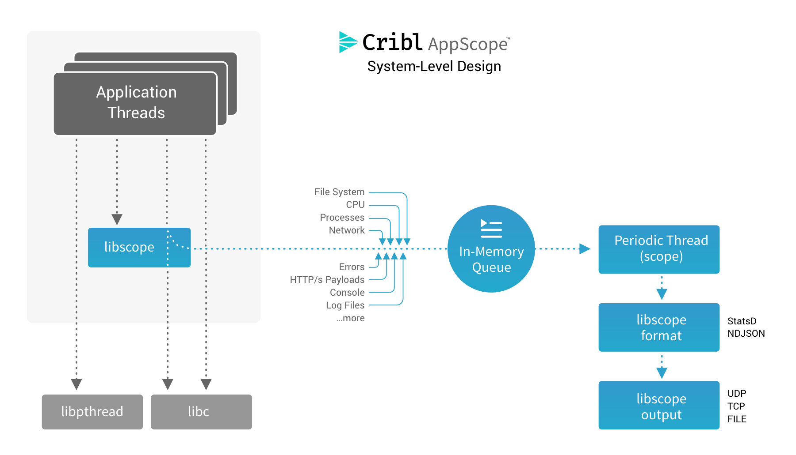

There are two ways to "scope" an application:

1. Attach AppScope to a running process.
1. Scope a new process. 

## How AppScope Works: Components

AppScope downloads as a single binary, but functionally speaking has several components including a command-line interface (CLI), a loader, and a library.

### The Command Line Interface (CLI)

The AppScope CLI (`scope`) [provides](/docs/cli-using) a quick and convenient way to explore capabilities, and to obtain insight into application behavior. No installation or configuration is required to get started exploring application behavior.

<span>&#x2605;&#x2605;&#x2605;</span> **WHEN TO USE**: The easiest way to get started with AppScope is to use the CLI. This provides a rich set of capabilities intended to capture data from single applications. Data is captured in the local file system, and is managed through the CLI.

To scope a new process, for example the `top` program:

```
scope top
```

To [scope a running process](/docs/attach-running) whose process ID (PID) is `12345`:

```
scope attach 12345
```

### The Loader

Linux, like many other operating systems, provides a loader capable of loading and linking dynamic and static executables as needed. AppScope [provides](/docs/loader-library) a very simple component (`ldscope`) that supports loading static executables. This allows AppScope to interpose functions, and to thereby expose the same data that is exposed from dynamic executables. While the AppScope loader is optional for use with dynamic executables, it is required in order to extract details from a static executable.

<span>&#x2605;&#x2605;&#x2605;</span> **WHEN TO USE**: As you get more interested in obtaining details from  applications, explore using the AppScope library apart from the CLI. This allows for full configurability via the `scope.yml` configuration file, detailed [here](/docs/config-files). You can forward captured data details over UDP, TCP, and local or remote connections, and you can define specific events and metrics for export. You can use the AppScope loader to start applications that include the library.

### The Library

The AppScope library (`libscope`) is the [core component](/docs/loader-library) that resides in application processes, extracting data as an application executes. You can closely configure the library's behavior using environment variables or a configuration file. 

The library extracts information by interposing functions. When an application calls a function, it actually calls a function of the same name in `libscope`, which extracts details from the function. Then the original function call proceeds. This interposition of function calls requires no change to an application: it works with unmodified binaries, and its CPU and memory overhead is minimal.

The library is loaded using a number of mechanisms, depending on the type of executable. A dynamic loader can preload the library (where supported), and AppScope is used to load static executables.

Child processes are created with the library present, if the library was present in the parent. In this manner, a single executable is able to start, daemonize, and create any number of children, all of which include interposed functions.


<span>&#x2605;&#x2605;&#x2605;</span> **WHEN TO USE**: As with the loader above, you can use the library independently, using the same configuration [file](/docs/config-files) and/or environment variables. Environment variables take precedence over the default configuration, as well as over details in any configuration file. You use an environment variable to load the library independent of any executable. Whether you use this option or the AppScope loader, you get full control of the data source, formats, and transports.


## System-Level Design 




### Performance Overhead
AppScope collects data with around 2% CPU overhead and **minimal** latency penalty. In most cases, the overhead is markedly less than 2%, which is significantly more efficient than legacy and current monitoring systems.
