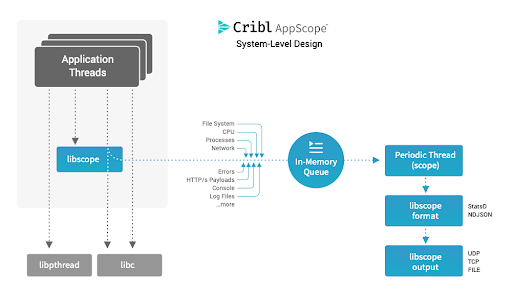

# How AppScope Works

AppScope consists of a shared library and an executable. In simple terms, you load the library into the address space of a process. With the library loaded, details are extracted from applications as they execute. The executable provides a command line interface (CLI), which can optionally be used to control which processes are interposed, what data is extracted, and how to view and interact with the results.

The library extracts information as it interposes functions. When an application calls a function, it actually calls a function of the same name in the AppScope library. AppScope extracts details from the function, and the original function call proceeds. This interposition of function calls requires no change to an application: it works with unmodified binaries, and its CPU and memory overhead are minimal. 

The library is loaded using a number of mechanisms, depending on the type of executable. A dynamic loader can preload the library (where supported) and AppScope is used to load static executables.

Child processes are created with the library present, if the library was present in the parent. In this manner, a single executable is able to start, daemonize, and create any number of children, all of which include interposed functions.

